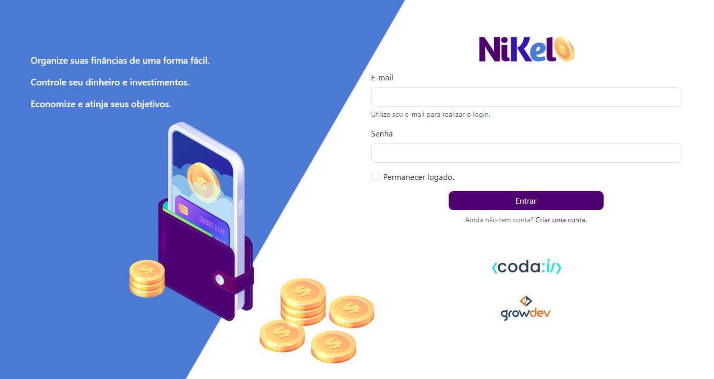

# Nikel

## Descrição do Projeto

Nikel é uma aplicação de gerenciamento financeiro desenvolvida como parte do curso de desenvolvimento Web Full Stack da [Growdev](https://www.growdev.com.br/). O projeto permite aos usuários controlar suas finanças, incluindo a adição, edição e exclusão de transações financeiras, além de visualizar relatórios sobre receitas e despesas.

## Funcionalidades

- **Adicionar Transações**: Permite aos usuários adicionar novas receitas e despesas ao seu histórico financeiro.
- **Listar Transações**: Visualize todas as transações registradas em uma interface amigável.
- **Atualizar Transações**: Edite as transações existentes para corrigir informações ou atualizar valores.
- **Excluir Transações**: Remova transações que não são mais necessárias.
- **Relatórios Financeiros**: Gere relatórios que mostram a distribuição de receitas e despesas, ajudando na tomada de decisões.

## Tecnologias Utilizadas

- **HTML**: Para estruturar a interface da aplicação.
- **JavaScript**: Para implementar a lógica da aplicação e interações do usuário.
- **CSS**: Para estilizar a interface e garantir uma boa experiência visual.
